# StoreRate 🌟

StoreRate is a premium, feature-rich web application designed to help users discover, rate, and compare local businesses (restaurants, cafes, bookstores, boutiques, and more). Built using a modern **Spring Boot** REST API backend and a responsive **React (Vite)** frontend, it features interactive dashboards for **Users**, **Store Owners**, and **Admins**.

---

## 📸 User Interface & Dashboard Gallery

### 🔐 Authentication Views

#### 1. Login Page
The secure portal interface for users, store owners, and administrators. It features the modern **StoreRate** branding and uses focus shadows.
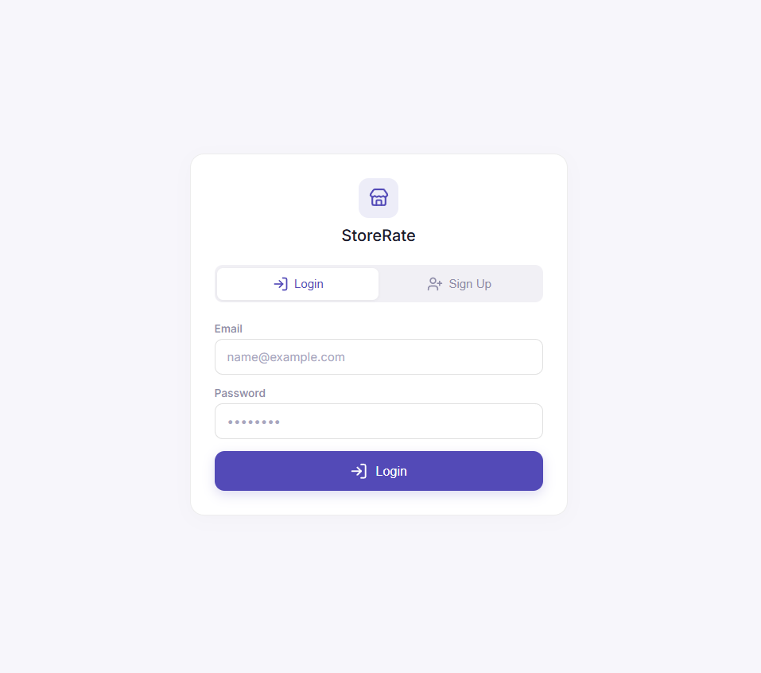

#### 2. Sign Up Page
Self-registration page for new users. Stretches to collect names (between 20-60 characters), emails, passwords (with complexity enforcement), and street addresses.
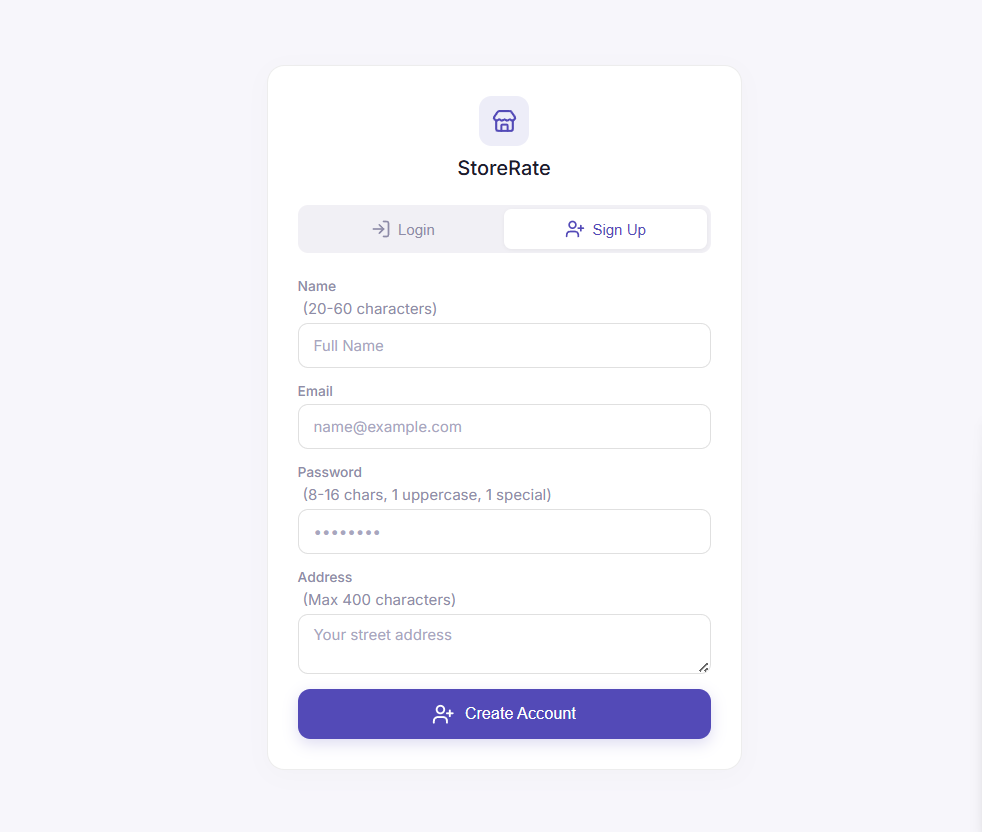

---

### 👤 User Store Explorer

#### 3. User Dashboard (UserPage)
The main store exploration feed. Displays a personalized taste profile (level XP indicator, achievement badges), search and filter tools, and a grid of interactive cards with Unsplash image integration.
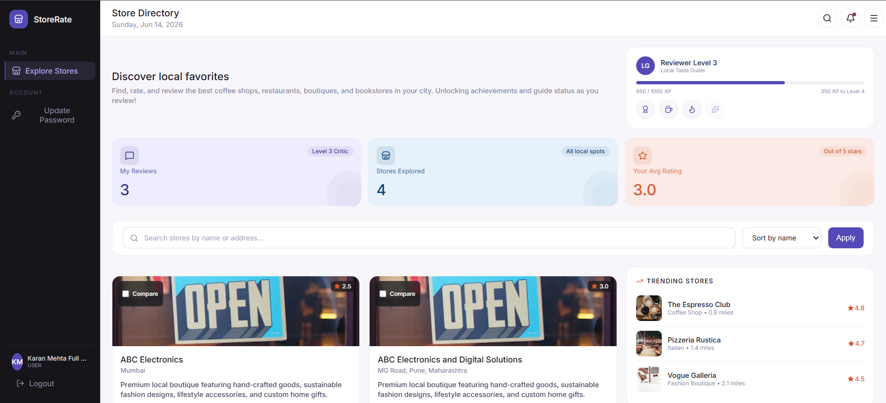

#### 4. Active Comparison Drawer (UserPage2)
Shows the floating compare shelf appearing at the bottom of the viewport as soon as two or more stores are checked for comparison.
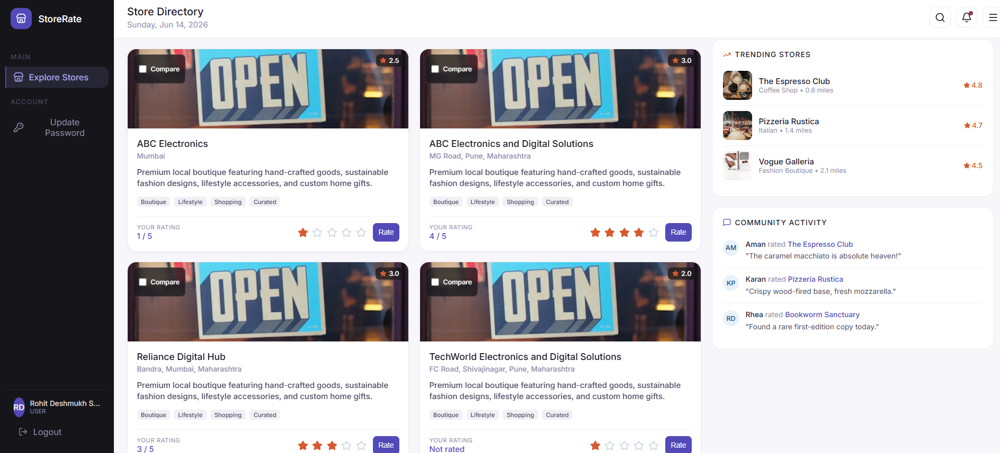

#### 5. Interactive Store Comparison (StoreCardWithRating)
The centered feature diff comparison matrix, displaying a side-by-side breakdown of attributes, highlighting differences in amenities (Wi-Fi, parking, outdoor seating), and crowning the highest-rated store with a gold "Best" badge.
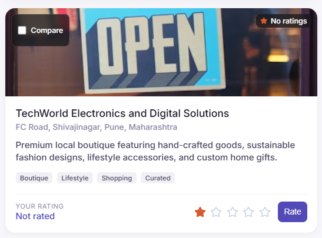

#### 6. Slide-in Password Update Modal (UpdatePassword)
Displays the global password slide-in drawer easing in from the right edge of the screen, allowing users to safely update credentials from any page.
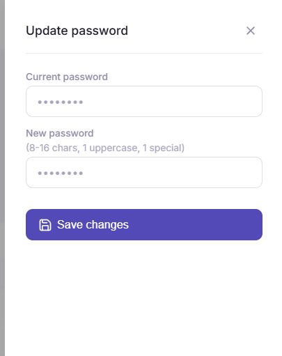

---

### 🏪 Store Owner Portal

#### 7. Owner Page
Dashboard specifically styled for store owners. Features light-blue and light-coral statistics cards, a feedback feed of customer reviews, and response management tools.
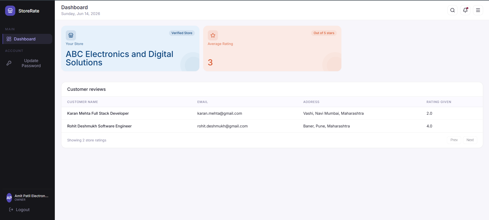

---

### ⚙️ Admin Management Console

#### 8. Admin Dashboard
Administrative cockpit displaying system stats (Total registered users, active stores, ratings submitted) on solid-colored high-contrast telemetry cards with decorative depth circles.
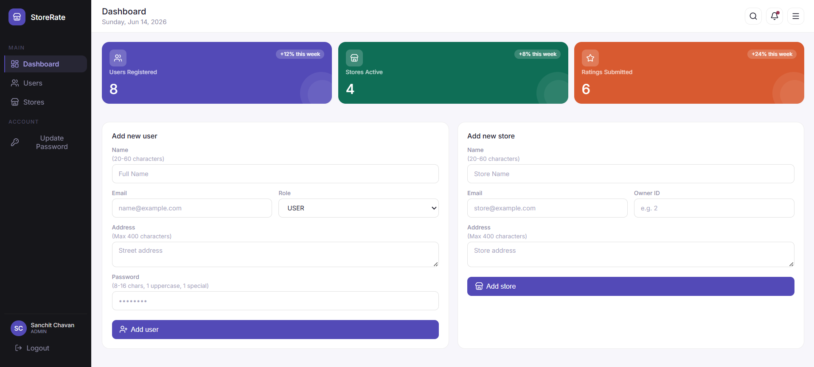

#### 9. Admin Users Section
Comprehensive list of all registered accounts (users, owners, admins) with custom-styled, role-colored pill badges, search filters, and delete actions.
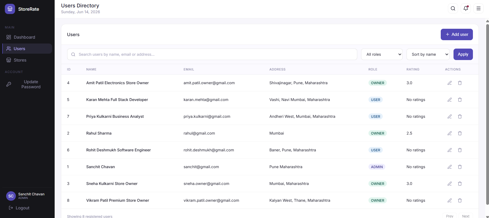

#### 10. Admin Stores Section
Centralized store management list for viewing, sorting, and registering new business locations, mapping owners directly by their user IDs.
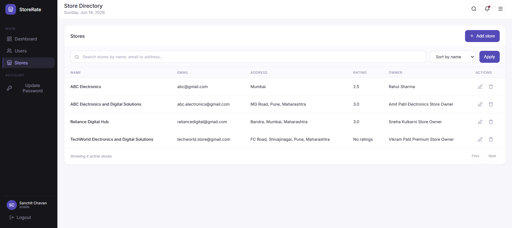

---

### 🗄️ Database & API Testing

#### 11. Postman API Testing
Verification of the backend REST controller endpoints (authentication, user administration, store lists, and rating updates) using Postman API collections.
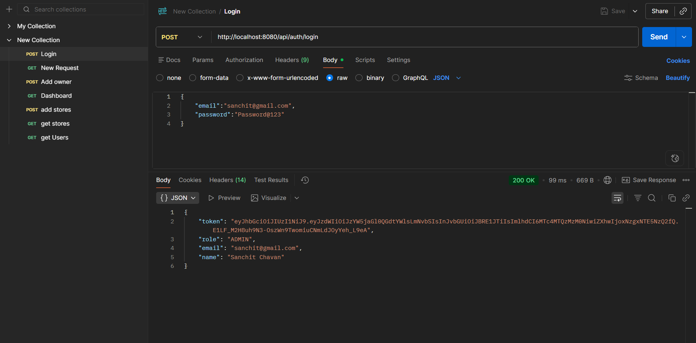

#### 12. PostgreSQL Database
Relational database tables (users, stores, ratings) showing the successfully stored records and relational schemas in PostgreSQL.
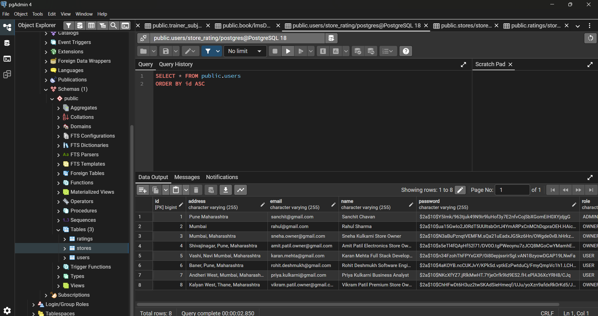

---

## ✨ Key Features

### 👤 Role-Based Portals
*   **User Portal**:
    *   Browse stores in a card-based grid layout with categorized high-quality visuals.
    *   Rate stores on a 5-star scale with micro-animations.
    *   Select up to 3 stores and compare them side-by-side using the **Store Comparison Diff Module**.
    *   Track contribution achievements (Reviewer level, XP bar, badges).
*   **Store Owner Portal**:
    *   Monitor the store's average rating and reviews.
    *   View customer feedback and rating metrics via light-colored stat cards.
*   **Administrator Portal**:
    *   Full CRUD capabilities to add, edit, or delete users and stores.
    *   Monitor system telemetry (Total Users, Active Stores, Ratings Submitted).
    *   Ensure data consistency (e.g., verifying that a store owner has the `OWNER` role and doesn't already own a store).

### 📊 Store Compare & Diff Engine
*   Multi-store selection bar floating dynamically at the bottom of the viewport.
*   Centered comparative overlay modal showing key attributes: Ratings, Price Category, Opening Hours, and amenities.
*   **Visual Diff Highlights**: Colors highlight checkmarks/crossmarks differently to draw attention to distinct store amenities.
*   Gold **"Best" crown badge** automatically highlights the highest-rated store in the comparison.

### 🔒 Secure Passwords Slide-in Modal
*   Instead of a static page, updating passwords occurs globally inside a **slide-in modal drawer** that eases in from the right edge of the screen, available across all dashboards.

---

## 🛠️ Tech Stack

### Backend
*   **Java 17**
*   **Spring Boot 3.x**
*   **Spring Security & JWT (JSON Web Tokens)**
*   **Spring Data JPA & Hibernate**
*   **H2 / PostgreSQL**
*   **Lombok**

### Frontend
*   **React 18 (Vite)**
*   **Vanilla CSS** (Custom token system utilizing the **Inter** system font stack)
*   **Lucide React** (Modern, clean icon set)
*   **Vite/Rolldown** build environment

---

## 🚀 Installation & Setup

### Prerequisites
*   Java JDK 17 or higher
*   Maven 3.x
*   Node.js (v18+) & npm

### 1. Backend Setup
1. Navigate to the backend directory:
    ```bash
    cd backend
    ```
2. Configure settings in `src/main/resources/application.properties` (uses in-memory H2 database by default).
3. Build and compile the project:
    ```bash
    mvn clean install
    ```
4. Run the application:
    ```bash
    mvn spring-boot:run
    ```
    *The REST API will boot on `http://localhost:8080`.*

### 2. Frontend Setup
1. Navigate to the frontend directory:
    ```bash
    cd ../frontend
    ```
2. Install npm packages:
    ```bash
    npm install
    ```
3. Run the development server:
    ```bash
    npm run dev
    ```
    *The React frontend will load on `http://localhost:5173`.*

---

## 🔒 Security & Validation Rules
1. **Passwords**: Must be 8-16 characters and contain at least one uppercase letter and one special character.
2. **Owners uniqueness**: A store owner can own a maximum of one store (enforced at both service layer and database schema levels).
3. **Data Integrity**: Store names and user names require 20 to 60 characters to prevent short spam entries.
